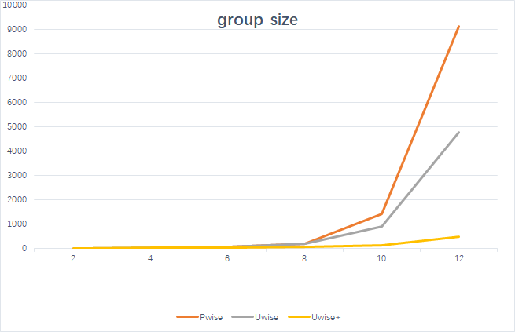

# G-Skyline

Our implementation of finding Group Skyline proposed in [Finding Pareto Optimal Groups: Group-based Skyline](http://www.vldb.org/pvldb/vol8/p2086-liu.pdf).

---

### Compilation

 + Mark the `data/` directory  as *Sources Root*.
 + Compile the project from `src/org/main/Experiments.java`.
 
### Running

 ```bash
 java -jar G-Skyline.jar FILE_NAME GROUP_SIZE METHOD
 ```
 + `FILE_NAME` should be in accordance with `.txt` files under `data/`.
 + `GROUP_SIZE` should be a positive integer.
 + `METHOD` should be a value among 0, 1 and 2.
    * `0`: Point-Wise
    * `1`: Unit Group-Wise
    * `2`: Unit Group-Wise Plus

### Results

 The line chart below shows the running time of the 3 methods when dealing with `inde_2.txt` given different group sizes.
 
